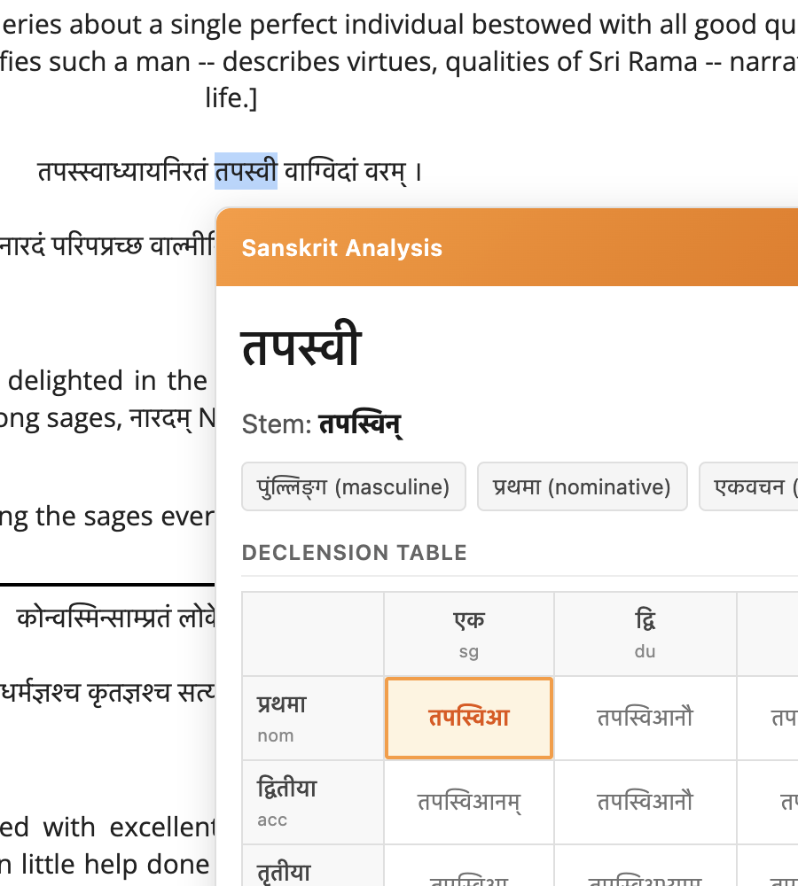
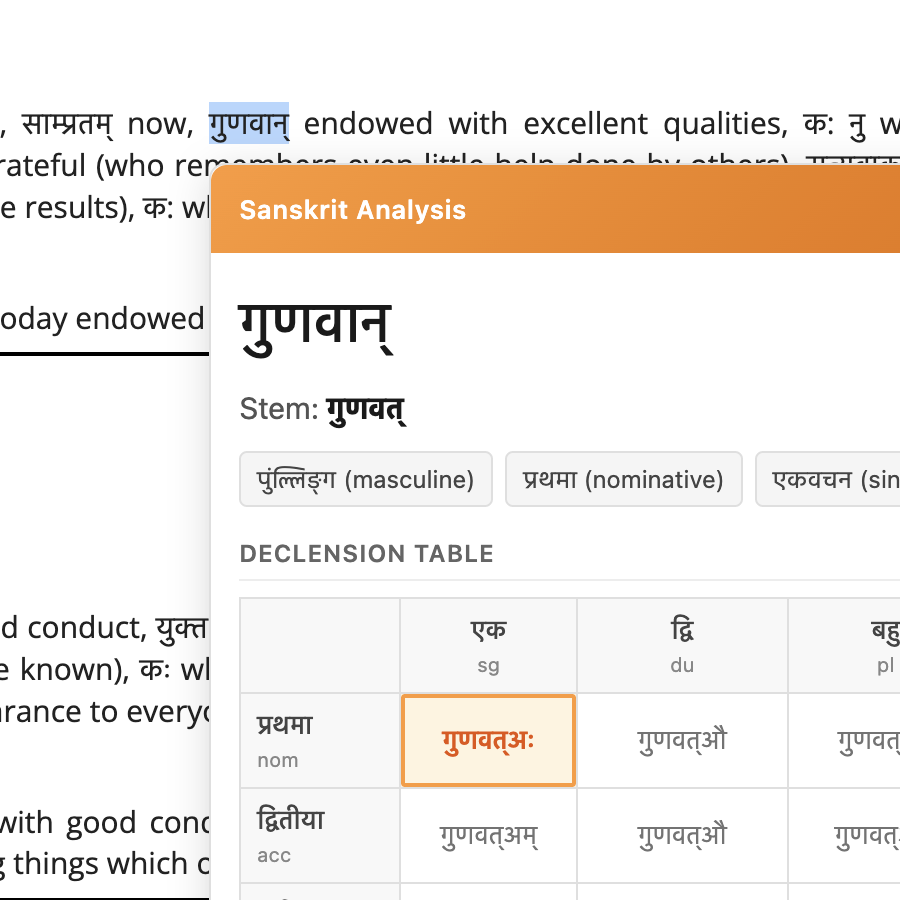

# Sanskrit Learner Chrome Extension

A Chrome extension for Sanskrit learners that provides word-level analysis, declension families, and grammatical relationship visualization.

**Core Insight:** Don't just teach the specific declension in context - show its family. The learner sees the word in its full paradigm.


## Features

Select any Sanskrit word (in Devanagari script) on a webpage and get:

- **Word Analysis** - Stem identification, gender, case, and number
- **Declension Table** - All 24 forms (8 cases × 3 numbers) with your selected form highlighted
- **Multiple Analyses** - When a word could have multiple interpretations, alternatives are shown
- **Works Everywhere** - Runs on any webpage with Sanskrit text

## Screenshots

<p align="center">
  
  &nbsp;&nbsp;
  
</p>

*Selecting words like तपस्वी (ascetic) and गुणवान् (virtuous) shows the stem, grammatical tags, and full declension table with the current form highlighted.*

## Installation

### From Source (Developer Mode)

1. Clone this repository:
   ```bash
   git clone https://github.com/maheshcr/sanskrit-aid-chrome-plugin.git
   ```

2. Open Chrome and navigate to `chrome://extensions`

3. Enable **Developer mode** (toggle in top right)

4. Click **Load unpacked** and select the `extension/` folder

5. The extension icon should appear in your toolbar

### Usage

1. Navigate to any page with Sanskrit text in Devanagari script
   - Try: [Valmiki Ramayana](https://www.valmiki.iitk.ac.in/sloka?field_kanda_tid=1&language=dv&field_sarga_value=1)
   - Or: [Sanskrit Documents](https://sanskritdocuments.org)

2. Select a Sanskrit word (e.g., रामः, सीता, वनम्)

3. A popup appears showing the grammatical analysis and full declension table

4. Click outside the popup or press Escape to dismiss

## What Works (v0.1.0)

- [x] Devanagari text detection
- [x] Word analysis via sanskrit_parser API
- [x] Grammatical tag parsing (gender, case, number)
- [x] Declension table generation for common stem types:
  - a-stem masculine (राम → रामः, रामौ, रामाः...)
  - a-stem neuter (फल → फलम्, फले, फलानि...)
  - ā-stem feminine (सीता → सीता, सीते, सीताः...)
  - i-stem, u-stem, ī-stem, ū-stem paradigms
  - Consonant stems (an-stem)
- [x] Current form highlighting in declension table
- [x] Enable/disable toggle in extension popup
- [x] Response caching for faster repeated lookups

## In Progress / Known Issues

- [ ] Declension endings need review by Sanskrit scholars (some forms may be incorrect)
- [ ] Verb conjugation tables not yet supported
- [ ] Sandhi splitting display not fully implemented
- [ ] Better icons needed (currently placeholder)
- [ ] Debug console.log statements still in code

## Planned Features

### Phase 2: Sentence-Level Graph View
- Transformer-style attention visualization
- Grammatical relationships (कारक relations)
- Which words agree in gender/number/case

### Phase 3: Sentence Families
- Example sentences for each declension variation
- "Sentence families" organized by paradigm
- Builds intuition for usage patterns

### Other Ideas
- IAST transliteration support
- Offline mode with local morphological data
- User-customizable themes (light/dark)
- Bookmarking/saving analyzed words
- Spaced repetition integration

## Technical Details

- **Manifest V3** Chrome extension
- **API:** [sanskrit_parser](https://github.com/kmadathil/sanskrit_parser) REST API
- **No build step** - Pure vanilla JavaScript
- **Permissions:** activeTab, storage, host_permissions for API

## Project Structure

```
extension/
├── manifest.json           # Extension configuration
├── content/
│   └── content.js          # Text selection & popup logic
├── background/
│   └── service-worker.js   # API proxy with caching
├── popup/
│   ├── popup.html          # Settings UI
│   └── popup.js            # Settings logic
├── styles/
│   └── content.css         # Popup styling
├── data/
│   ├── nominal-endings.json    # Declension paradigms
│   └── slp1-devanagari.json    # Transliteration maps
└── icons/                  # Extension icons
```

## Contributing

Contributions welcome! Especially:
- Sanskrit scholars to review/correct declension data
- UI/UX improvements
- Additional stem type paradigms
- Bug reports and feature requests

## Resources

- [Sanskrit Heritage Site](https://sanskrit.inria.fr/) - Gérard Huet's comprehensive tools
- [Digital Corpus of Sanskrit](http://www.sanskrit-linguistics.org/dcs/)
- [sanskrit_parser](https://github.com/kmadathil/sanskrit_parser) - The API we use

## License

MIT License - See [LICENSE](LICENSE) for details

---

*Built for Sanskrit learners who want to see the language's beautiful regularity.*
