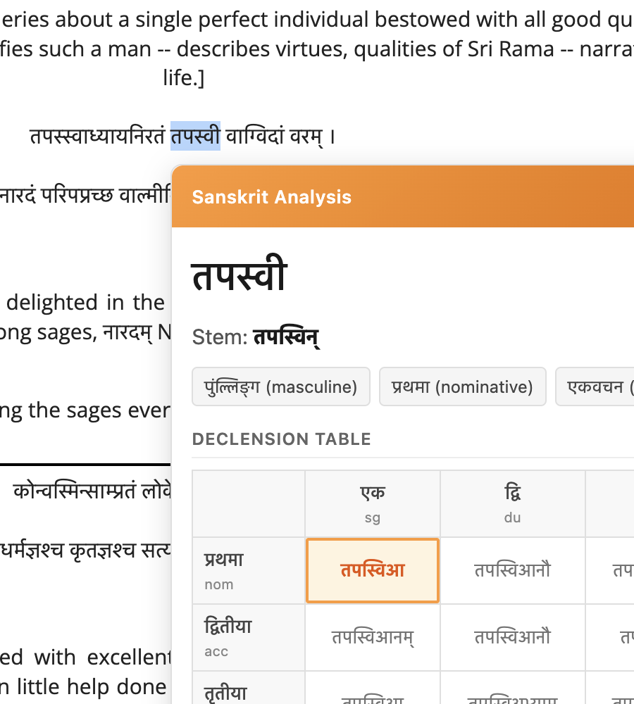
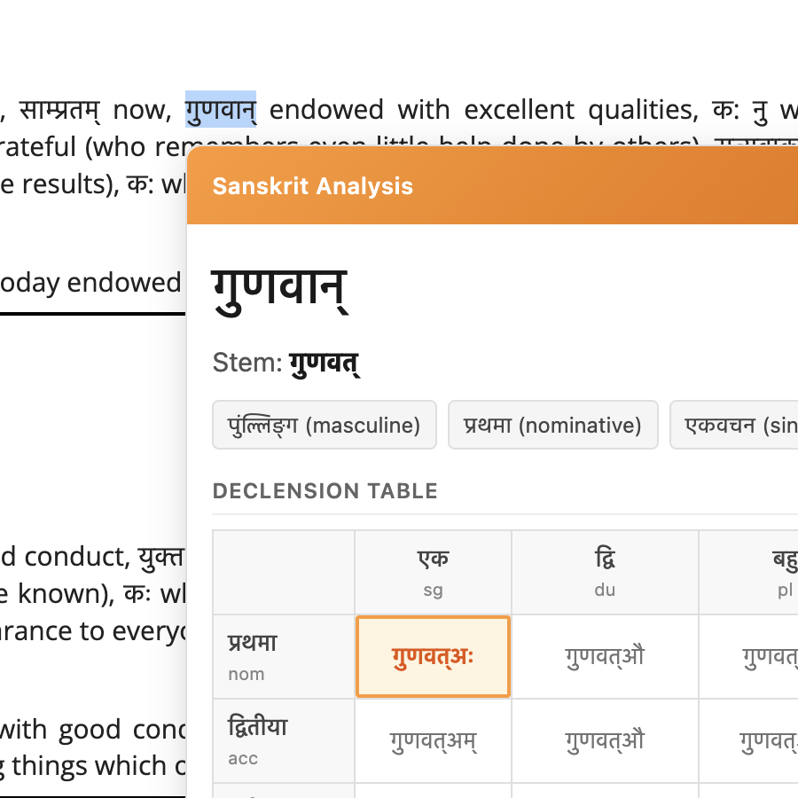

# Sanskrit Learner Chrome Extension

A Chrome extension for Sanskrit learners that provides word-level analysis, declension families, audio pronunciation, and compound splitting.

**Core Insight:** Don't just teach the specific declension in context — show its family. The learner sees the word in its full paradigm.


## Features

Select any Sanskrit word (in Devanagari script) on a webpage and get:

- **Declension Families** — All 24 forms (8 cases x 3 numbers) with your form highlighted. Powered by Vidyut (Paninian grammar engine), covering 120+ paradigms and 1,700+ word forms.
- **Audio Pronunciation** — Click the speaker icon to hear native-quality Sanskrit pronunciation via ai4bharat/indic-parler-tts (99.79% Native Speaker Score).
- **Sandhi & Compound Splitting** — Two-tier splitting: sanskrit-parser for simple splits, Dharmamitra for deep compounds like तपस्वाध्यायनिरतम्.
- **Grammatical Analysis** — Stem identification, gender, case, number, and suffix.
- **Feedback System** — Report corrections or missing analyses. Stored locally, exportable as JSON.
- **Works Everywhere** — Runs on any webpage with Devanagari text.

## Screenshots

<p align="center">
  
  &nbsp;&nbsp;
  
</p>

*Selecting words like तपस्वी (ascetic) and गुणवान् (virtuous) shows the stem, grammatical tags, and full declension table with the current form highlighted.*

## Installation

### From Source (Developer Mode)

1. Clone this repository:
   ```bash
   git clone https://github.com/maheshcr/sanskrit-aid-chrome-plugin.git
   ```

2. Open Chrome and navigate to `chrome://extensions`

3. Enable **Developer mode** (toggle in top right)

4. Click **Load unpacked** and select the `extension/` folder

5. The extension icon should appear in your toolbar

### Usage

1. Navigate to any page with Sanskrit text in Devanagari script
   - Try: [Valmiki Ramayana](https://www.valmiki.iitk.ac.in/sloka?field_kanda_tid=1&language=dv&field_sarga_value=1)
   - Or: [Sanskrit Documents](https://sanskritdocuments.org)

2. Select a Sanskrit word (e.g., रामः, सीता, वनम्)

3. A popup appears showing grammatical analysis and full declension table

4. Click the speaker icon to hear the pronunciation

5. Click outside the popup or press Escape to dismiss

## What's in v0.2.0

- [x] Devanagari text detection
- [x] Word analysis via sanskrit_parser API
- [x] Grammatical tag parsing (gender, case, number)
- [x] Vidyut-generated declension data (120 paradigms, 1,722 forms)
- [x] Current form highlighting in declension table
- [x] Sandhi/compound splitting (sanskrit-parser + Dharmamitra fallback)
- [x] Audio pronunciation (indic-parler-tts via CF Worker + R2 cache)
- [x] User feedback form with local storage and export
- [x] Enable/disable toggle in extension popup
- [x] Response caching for faster repeated lookups
- [x] Test suite (31 tests passing)

## Architecture

```
extension/
├── manifest.json              # Extension configuration (Manifest V3)
├── content/
│   └── content.js             # Text selection, popup, audio playback
├── background/
│   └── service-worker.js      # API proxy, caching, transliteration
├── popup/
│   ├── popup.html             # Settings UI
│   └── popup.js               # Settings logic
├── feedback/
│   ├── feedback.html          # Feedback form UI
│   └── feedback.js            # Feedback storage and export
├── styles/
│   └── content.css            # Popup and audio button styling
├── data/
│   ├── declensions-bundle.json    # Vidyut-generated paradigms (335KB)
│   └── slp1-devanagari.json       # Transliteration maps
└── icons/                     # Extension icons

server/
├── hf-space/                  # HuggingFace Space (TTS model)
│   └── app.py                 # indic-parler-tts inference
├── cf-worker/                 # Cloudflare Worker (TTS cache)
│   └── src/index.js           # R2 cache + HF Space proxy
├── generate_declensions.py    # Vidyut declension data generator
├── batch_generate_audio.py    # Batch TTS pre-generation
└── data/                      # Generated declension data
```

### TTS Pipeline

```
Extension  →  CF Worker (R2 cache)  →  HF Space (ZeroGPU)
              cache hit? serve.         ai4bharat/indic-parler-tts
              cache miss? generate,     Speaker: "Aryan" (Sanskrit)
              cache, serve.             float32 precision
```

## Development

```bash
# Install dependencies
pnpm install

# Run tests
pnpm test

# Watch mode
pnpm test:watch
```

## Planned

- [ ] Chrome Web Store submission
- [ ] Firefox / Brave support
- [ ] Verb conjugation tables
- [ ] Sentence-level grammatical visualization
- [ ] IAST transliteration toggle
- [ ] Spaced repetition integration

## Privacy

No personal data collected. No accounts, no tracking, no analytics. Selected words are sent to third-party APIs (sanskrit-parser, Dharmamitra) for analysis only. See [Privacy Policy](docs/PRIVACY-POLICY.md).

## Contributing

Contributions welcome! Especially:
- Sanskrit scholars to review/correct declension data
- UI/UX improvements
- Additional stem type paradigms
- Bug reports and feature requests

## Resources

- [Vidyut](https://github.com/ambuda-org/vidyut) — Paninian grammar engine (declension data source)
- [ai4bharat/indic-parler-tts](https://huggingface.co/ai4bharat/indic-parler-tts) — Sanskrit TTS model
- [Sanskrit Heritage Site](https://sanskrit.inria.fr/) — Gerard Huet's comprehensive tools
- [Dharmamitra](https://dharmamitra.org) — BDRC's Sanskrit analysis tools
- [sanskrit_parser](https://github.com/kmadathil/sanskrit_parser) — Sandhi splitting API

## License

MIT License — See [LICENSE](LICENSE) for details.

## Contact

hello@maheshcr.com

---

*Built for Sanskrit learners who want to see the language's beautiful regularity.*
